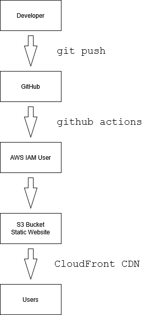

# AWS Static Website Deployment with CI/CD

A professional DevOps project demonstrating automated, secure deployment of a static portfolio website on AWS using Amazon S3, CloudFront, and GitHub Actions.

---

## 📌 Project Overview

This project showcases the implementation of a modern, automated deployment pipeline for a static website. By leveraging cloud hosting, global content delivery, strict IAM security, and CI/CD automation, this setup reflects production-grade engineering practices commonly used in DevOps environments.

### Key Highlights:
*   **Zero-Downtime Deployments:** Automated via GitHub Actions.
*   **Security First:** IAM-based authentication with Principle of Least Privilege (PoLP) and secure secret management.
*   **Performance Optimization:** Global caching and HTTPS delivery via Amazon CloudFront.

---

## 🏗️ Architecture

The deployment architecture ensures low-latency content delivery and high availability:



### AWS Services & Responsibilities

| Service | Component Role | Core Responsibilities |
| :--- | :--- | :--- |
| **Amazon S3** | Object Storage & Hosting | • Secure storage of static source assets (HTML, CSS, Images).<br>• Acts as the origin server for CloudFront. |
| **Amazon CloudFront** | Content Delivery Network (CDN) | • Enforces global HTTPS-only delivery.<br>• Minimizes latency via edge location caching.<br>• Shields the S3 origin from direct public access. |
| **AWS IAM** | Identity & Access Management | • Enforces least-privilege access for automation.<br>• Restricts GitHub Actions runner permissions strictly to S3 syncing and CloudFront invalidations. |

---

## ⚙️ CI/CD Workflow Pipeline

1. **Code Commit:** Developer pushes updated source code to the `main` branch of the GitHub repository.
2. **Trigger:** The GitHub Actions runner initializes the defined deployment workflow.
3. **Authentication:** AWS credentials (`AWS_ACCESS_KEY_ID` and `AWS_SECRET_ACCESS_KEY`) are securely injected into the runner environment using **GitHub Secrets**.
4. **Artifact Deployment:** Website assets are securely synchronized to the designated Amazon S3 bucket.
5. **Cache Management:** A CloudFront cache invalidation request (`/*`) is programmatically triggered to purge stale edge assets.
6. **Delivery:** Updated, high-performance content becomes instantly accessible to global end-users.

---

## 📂 Project Structure

```text
aws-static-website-cicd/
├── .github/
│   └── workflows/
│       └── deploy.yml            # CI/CD pipeline definition
├── architecture/
│   └── architecture-diagram.png  # High-level architecture diagram
├── screenshots/                  # Verified deployment evidence
│   ├── github-repository.png
│   ├── github-actions-success.png
│   ├── s3-bucket.png
│   ├── cloudfront-distribution.png
│   ├── website-live.png
│   └── deployment-logs.png
├── index.html                    # Website entry point
└── styles.css                    # UI styling asset
```


## 📚 Lessons Learned

<ul>
  <li>Learned how static website hosting works in Amazon S3.</li>
  <li>Understood the difference between S3 Website Endpoint and S3 REST Endpoint.</li>
  <li>Configured CloudFront for content delivery and caching.</li>
  <li>Implemented CI/CD using GitHub Actions.</li>
  <li>Managed AWS credentials securely using GitHub Secrets.</li>
  <li>Learned IAM permission management.</li>
  <li>Troubleshot CloudFront cache invalidation issues.</li>
  <li>Resolved AWS Access Denied and permission-related errors.</li>
</ul>


## 📚 Future Improvements

<ul>
  <li>Provision infrastructure using Terraform.</li>
  <li>Configure custom domain using Route53.</li>
  <li>Enable SSL using AWS Certificate Manager.</li>
  <li>Implement GitHub OIDC instead of IAM access keys.</li>
  <li>Add CloudWatch monitoring and alerts.</li>
  <li>Introduce Infrastructure as Code (IaC) practices.</li>
</ul>
